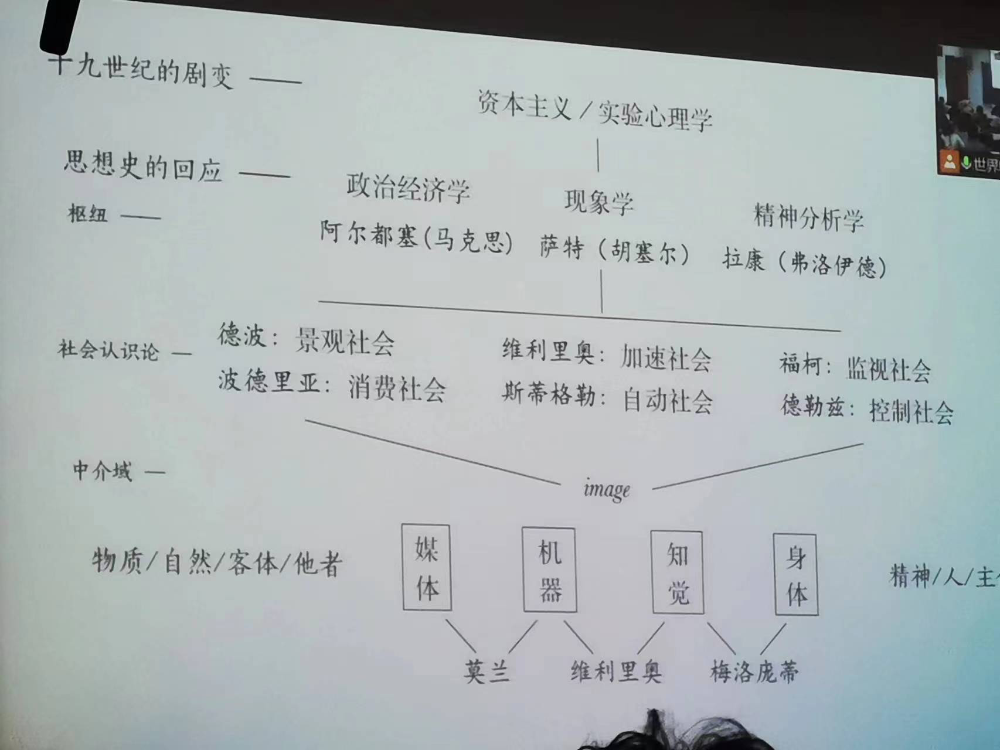

#  世界电影专题

[李洋](https://www.art.pku.edu.cn/szdw/qzjs/ysxllx/ly/index.htm) 2023 Spring

**课程**

世界电影史申请变两学分的结果。

电影哲学的专题课，聚焦理论：ly本学期在写一本理论书《法国电影哲学史》。上学期讲哲学家思想和电影的关系；这学期只讲[吉尔·德勒兹](https://zh.wikipedia.org/zh-hans/%E5%90%89%E5%B0%94%C2%B7%E5%BE%B7%E5%8B%92%E5%85%B9)，围绕两本著作，[运动-影像](/Users/winston/Documents/BA/5-2/3.世界电影史+专题/reference/运动影像.pdf)，[时间-影像](/Users/winston/Documents/BA/5-2/3.世界电影史+专题/reference/时间影像.pdf)；柏格森

反符号中心主义；《什么是创造性行为什么是创造》

## 什么是“电影时代”

导论

电影理论，起先少有哲学影像，巴赞。德勒兹后，电影反映当代哲学问题；哲学家生活在电影时代，电影体验融入个人思考。

一、电影时代。战后法国哲学家：精神分析、意识形态、技术等角度讨论现代问题，参与电影的套路。法国，“大街”哲学，欢迎误用（英美科学哲学，德国经验哲学），因为关心时代症候。

二、知觉机器与机器知觉。

三、影片与影像。反符号中心主义，重新分类。

四、屏幕与装置。情境，福柯记忆装置……

五、幽灵与他者。可见的电影表达不可见的幽灵；显现他者作为永恒存在

**20世纪法国哲学**

三个源头人物：雅克·拉康（对应弗洛伊德）、路易·阿尔杜塞（对应马克思）、柏格森（达尔文）。

之所以重要：十九世纪发生的变化，“断裂”。

- 科学概念
  - 威廉·冯特 - 弗洛伊德 - 拉康
  - 达尔文 - 柏格森
- 工业图像
  - 马克思 - 阿尔杜塞

20世纪法国哲学回应

- 人
- 世界
- 知识工具

*二元对立中加入工具。*

---

[冯特](https://zh.wikipedia.org/zh-hans/%E5%A8%81%E5%BB%89%C2%B7%E5%86%AF%E7%89%B9)、弗洛伊德、胡塞尔

实验心理学：实证美学，推翻经验美学；莱比锡大学；蔡元培的老师冯特。

开创科学心理学/现代心理学，标志心理学从哲学中独立，且抛弃了哲学的方法。

实验方法出现。科学观念渗透，化验、测量等，获得科学的指标。

哲学心理学，发展为胡塞尔现象学。不通过实验方法，还是信奉科学观。

精神分析方法，潜意识

---

工业图景 意识形态

---

达尔文 - 柏格森

---